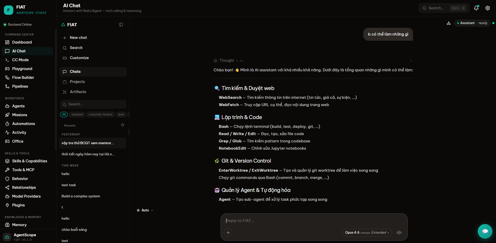
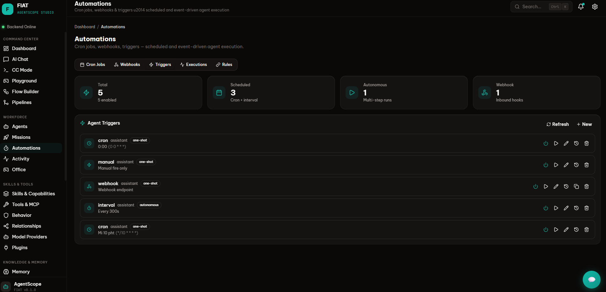
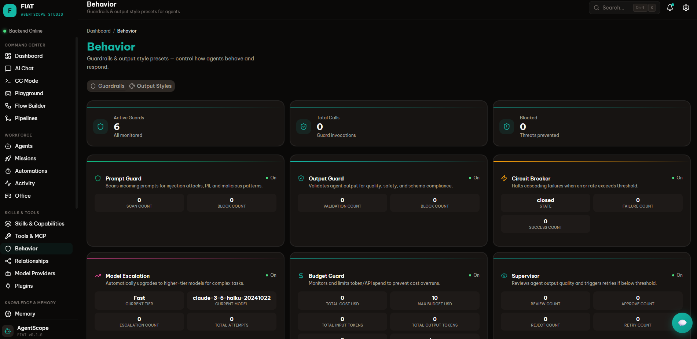

  

<h1 align="center">🤖 FIAT — Full-stack Intelligent Agent Toolkit</h1>

  <b>A production-grade AI agent platform with multi-agent orchestration, real-time streaming, and a modern glassmorphism UI.</b>

  
  
  
  
  
  

---

## 📌 Overview

**FIAT** is a full-stack AI agent platform I designed and built. It supports single-agent chat, multi-agent orchestration, RAG pipelines, knowledge bases, and more — all behind a unified API and a polished React frontend.

> ⚠️ This is a **private project** — this repo contains only the README for portfolio purposes. The full source code is available upon request.

---

## ✨ Features

### 💬 AI Chat — Intelligent Conversation with Tool Calling

  

- **ReAct Agent Loop** — reasoning + action cycle with real-time thought streaming
- **40+ Built-in Tools** — web search, code execution, file I/O, git, data analysis, and more
- **Multi-model Support** — OpenAI, Anthropic (Claude), Gemini, Qwen, Ollama
- **MCP Integration** — Model Context Protocol for connecting external tool servers

---

### ⚡ Automations — Scheduled & Event-driven Agent Execution

  

- **Cron Jobs** — schedule agents on any cron expression
- **Webhooks & Triggers** — trigger agent workflows from external services or custom events
- **Autonomous Mode** — agents that run independently on intervals without human input

---

### 🛡️ Behavior — Guardrails, Safety & Quality Control

  

- **Prompt & Output Guard** — scans for injection attacks, PII, and validates response quality
- **Circuit Breaker** — halts cascading failures when error rate exceeds threshold
- **Model Escalation & Budget Guard** — auto-upgrades models for complex tasks, limits token spend
- **Supervisor** — reviews output quality and triggers retries if below threshold

---

## 🔧 More Capabilities

<table>
<tr>
<td width="50%" valign="top">

### 🧠 Multi-Agent Orchestration
- Phased, hierarchical, and plan-build orchestration modes
- Smart routing — auto-classifies intent and selects the best strategy
- Human-in-the-loop (HITL) with approval gates
- Handoff tools for lightweight agent-to-agent delegation

</td>
<td width="50%" valign="top">

### 🗃️ Knowledge & Memory
- RAG pipeline with multi-format ingestion (PDF, DOCX, PPTX, Excel)
- Vector search across Milvus, Qdrant, MongoDB
- Short-term + long-term memory with auto-compression
- Brain / Vault — git-backed wiki-like knowledge management

</td>
</tr>
<tr>
<td width="50%" valign="top">

### 🔗 Protocols & Integrations
- **MCP** — Model Context Protocol for external tools
- **A2A** — Google's Agent-to-Agent protocol
- Plugin system for custom extensions
- Temporal workflows for durable, long-running tasks

</td>
<td width="50%" valign="top">

### 🎨 Frontend
- 45+ pages — chat, agents, tools, RAG, memory, org, tracing, ...
- Dark glassmorphism design with teal accents
- Real-time streaming UI with live tracing
- Zustand state management + feature-based architecture

</td>
</tr>
</table>

---

## 🧰 Tech Stack

| Layer | Technologies |
|-------|-------------|
| **Backend** | Python 3.10+, FastAPI, SQLAlchemy, Alembic, Pydantic |
| **Frontend** | React 18, TypeScript, Vite, Tailwind CSS 4, Zustand |
| **AI / LLM** | OpenAI, Anthropic, DashScope (Qwen), Gemini, Ollama |
| **Protocols** | MCP, A2A (Agent-to-Agent), SSE streaming |
| **Vector DBs** | Milvus, Qdrant, MongoDB, OceanBase |
| **Memory** | Redis, SQLite, In-Memory, Mem0 |
| **Orchestration** | Temporal, asyncio concurrency |
| **Observability** | OpenTelemetry, Langfuse |
| **Infra** | Docker, Docker Compose, K8s-ready |

---

## 📊 Scale

| Metric | Value |
|--------|-------|
| Backend modules | 30+ Python modules (~200k+ LoC) |
| API routes | 100+ REST endpoints |
| Frontend pages | 45+ React pages |
| LLM providers | 5+ (OpenAI, Anthropic, Qwen, Gemini, Ollama) |
| Vector DB integrations | 5 (Milvus, Qdrant, MongoDB, MySQL, OceanBase) |
| Built-in tools | 40+ |

---

## 👤 Author

**Luan Dam Quang**  
📧 luandq92@gmail.com  
🔗 [GitHub](https://github.com/Ozyohz)

---

  <i>Built with ❤️ and a lot of caffeine ☕</i>

